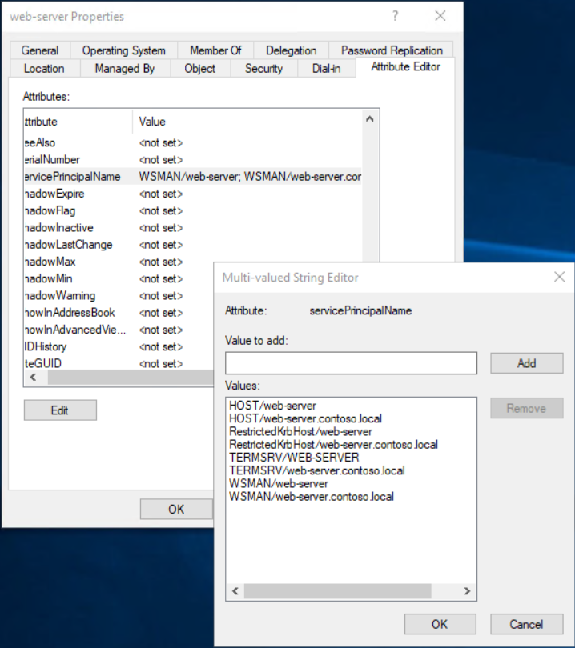

# Expose a Kerberos secured on prem API with Azure APIM

Application Proxy is a feature of Azure AD that enables users to access on-premises web applications from a remote client. Application Proxy includes both the Application Proxy service which runs in the cloud, and the Application Proxy connector which runs on an on-premises server. Azure AD, the Application Proxy service, and the Application Proxy connector work together to securely pass the user sign-on token from Azure AD to the web application.

Application Proxy works with:

* Web applications that use [Integrated Windows authentication](https://docs.microsoft.com/en-us/azure/active-directory/app-proxy/application-proxy-configure-single-sign-on-with-kcd) for authentication
* Web applications that use form-based or [header-based](https://docs.microsoft.com/en-us/azure/active-directory/app-proxy/application-proxy-configure-single-sign-on-with-headers) access
* Web APIs that you want to expose to rich applications on different devices
* Applications hosted behind a [Remote Desktop Gateway](https://docs.microsoft.com/en-us/azure/active-directory/app-proxy/application-proxy-integrate-with-remote-desktop-services)
* Rich client apps that are integrated with the Microsoft Authentication Library (MSAL)

Application Proxy supports single sign-on. For more information on supported methods, see [Choosing a single sign-on method](https://docs.microsoft.com/en-us/azure/active-directory/manage-apps/sso-options#choosing-a-single-sign-on-method).

Application Proxy is recommended for giving remote users access to internal resources. Application Proxy replaces the need for a VPN or reverse proxy. It is not intended for internal users on the corporate network.  These users who unnecessarily use Application Proxy can introduce unexpected and undesirable performance issues.

You can read more about Application Proxy here [https://docs.microsoft.com/en-us/azure/active-directory/app-proxy/application-proxy](https://docs.microsoft.com/en-us/azure/active-directory/app-proxy/application-proxy)

In this walkthrough you will see how you can use Azure API Manager to safely expose Kerberos secured on premises APIs with the use of Azure AD Application Proxy.

## Pre-Requisites ##
- An Azure subscription with contributor rights in a resource group 
- Access to an Azure AD tenant with global admin rights
- Azure CLI version 2.0.81 or later

## Deploy on-prem infrastructure (optional)
You are going to simulate the on premise runing infrastructure in Azure. So you are going to deploy a new AD and a sample Web application and use Kerberos authentication to access it.

> **NOTE**
>
> You will need to follow the next steps of this section if you don't already have an on prem domain and a web application or API using Kerberos authentication.

1. Deploy AD controllers
   
   There are multiple different ways to provision a domain for your organization, probably the easiest one though, since this walkthrough is using Azure to simulate the on-premise environment, is to use one of the available ARM templates from the [Azure Quickstart Templates](https://azure.microsoft.com/en-us/resources/templates/?term=Domain+) Gallery.

   For the purposese of this guide you will be using the [Create a new AD Domain with 2 DCs using Availability Zones](https://azure.microsoft.com/en-us/resources/templates/active-directory-new-domain-ha-2-dc-zones/) one, which creates 2 VMs in separate Availability Zones to be AD DCs (primary and backup) for a new Forest and Domain.

   > **NOTE**
   >
   > This Azure Resource Manager template was created by a member of the community and not by Microsoft. Each Resource Manager template is licensed to you under a license agreement by its owner, not Microsoft. Microsoft is not responsible for Resource Manager templates provided and licensed by community members and does not screen for security, compatibility, or performance. Community Resource Manager templates are not supported under any Microsoft support program or service, and are made available AS IS without warranty of any kind.

   Using your WSL terminal after [installing the Azure CLI](https://docs.microsoft.com/en-us/cli/azure/install-azure-cli-linux?pivots=apt) or the Azure portal Cloud Shell run the following commands to provision your domain.

   ```bash
   az group create --name <resource-group-name> --location <resource-group-location> 
   az group deployment create --resource-group <my-resource-group> --template-uri https://raw.githubusercontent.com/Azure/azure-quickstart-templates/master/application-workloads/active-directory/active-directory-new-domain-ha-2-dc-zones/azuredeploy.json

   ```
   You will have to provide values for the following parameters (bold are required) either through a parameters file or through command line arguments
      
   | Parameter Name | Description |
   | -------------- | ----------- |
   | **adminUsername**	| The name of the Administrator of the new VM and Domain |
   | location       | Location for the VM, only certain regions support zones during preview. |
   | **adminPassword**  | The password for the Administrator account of the new VM and Domain |
   | **domainName**     | The FQDN of the AD Domain created |
   | **dnsPrefix**      | The DNS prefix for the public IP address used by the Load Balancer |
   | vmSize         | Size of the VM for the controller |


2. Deploy Web Server

    Same as with the Domain controllers you will be using an available ARM template from the [Azure Quickstart Templates](https://azure.microsoft.com/en-us/resources/templates/?term=Domain+) Gallery.

    For the purposese of this guide you will be using the [IIS Server using DSC extension on a Windows VM](https://azure.microsoft.com/en-us/resources/templates/dsc-extension-iis-server-windows-vm/) one, which creates a Windows VM and sets up an IIS server using the DSC extension.

    ```bash
    az group deployment create --resource-group <my-resource-group> --template-uri https://github.com/kopantos/Azure-How-To/blob/main/kerberos-onprem-api-with-apim/arm/ContosoWebsite.ps1.zip 
    ```
    
    You will have to provide values for the following parameters (bold are required) either through a parameters file or through command line arguments
      
   | Parameter Name | Description |
   | -------------- | ----------- |
   | diskType       | Type of the Storage for disks |
   | vmName         | Name of the VM |
   | vmSize         | Size of the VM |
   | imageSKU       | Image SKU |
   | **adminUsername**  | Admin username |
   | **adminPassword**  | Admin password |
   | **virtualNetworkName** | Virtual network name to deploy the VM to.
   | **subnetName** | The subnet name to deploy the VM to.
   | location       | Location for all resources. |

   Once the web server has been provisioned you will have to domain join it to the Domain you created in the previous step. Use RDP to connect to the web server and start a new powershell terminal. Use the Add-Computer cmdlet to join the computer to your domain and then restart the VM. When prompted, enter the domain admin credentials you specified at the domain provisioning step:

   ```powershell
   Add-Computer -DomainName CONTOSO.local -Restart
   ```

3. Deploy Web Application
   
   1. Use RDP to connect to the web server, download the following sample app https://github.com/kopantos/Azure-How-To/blob/main/kerberos-onprem-api-with-apim/deployment/SampleAPI.zip and unzip the contentes in the directory ```C:\inetpub\wwwroot\contoso-api```

   2. From IIS Manager console right click on sites and create a new site 
      

   3. Configure site authentication by disabling all authentication methods except windows. Select providers from the right hand side menu and make sure Negotiate (for kerberos) and NTLM providers are selected
      

   4. (Optional) From the authorization settings configure the users that should have access to the web application and API
      

   Tring to access the application at http://web-server.contoso.local/ from the browser now should challenge you for a domain account and providing the right credentials should allow you to browse to the default web page of the .Net sample application.

   

## Setup AD Sync
The first step you'll have to take in order to efectively use application proxy for your on premise application is sync your on premise AD with your Azure AD. To do that you can use Azure AD Connect


## Setup Azure Application Proxy

1. **Install the connector**: Download the service from the Application Proxy configuration page top bar of your Azure AD. Run the connector installer on a server which has network access to the services you wish to publish through the application proxy – it doesn’t have to be physically in the same location, it can even be on an Azure virtual machine so long as you have a VPN set up. The connector is supported on Windows Server 2012 R2 and newer editions and you can have multiple connectors deployed in groups to achieve HA and scale.

2. **Enable the connector**: Once the setup is complete you’ll need to go back to the Azure portal and the Application Proxy page, if you’ve still got it open then give it a refresh. You’ll see that there’s now a connector group called Default, and inside it is a connector which should show its status as Active. Click on Enable application proxy in the toolbar at the top.

   

3. **Create an Application**: Now you will need to create the app you want to access through the App Proxy. Click on Configure an app at the top.

   1. Work your way through the fields, the basic information you’ll need for this is the **internal URL** for the service you want to publish through the proxy, 
   
   2. Next enter the **external URL** for your application, 
   
      > **NOTE**: You’ll have to configure DNS and upload an SSL certificate if you use anything but the default msappproxy.net domain. A PFX file containing the certificate and private key works here. This address is what your end users will be using to access the internal service.
   
   3. Select the **authentication** you want to use. For this walkthrough you will use Azure Active Directory to define who has permission to access this application in Azure, and those permitted access will be allowed through. 
   
      > **NOTE**: If your application doesn’t know how to interface with this then you may end up with double authentication prompts for your users – one from Azure, and one from the internal application. The alternative is to use passthrough, where the authentication is handled by the internal application rather than by Azure.

   4. Select the **Default Connector Group** that you have provisioned

      Accept the default values for the other settings and then click Add at the top toolbar

      

   Once the application is provisioned you can find it by navigating to Azure AD > Enterprise Applications > All applications, and searching for it. You will first need to assign users and/or groups to access it. From the Getting Started icons click on the first one and **add a user that is synced from the on premise AD**.

   

   Next you will need to enable Single Sign On. Click the **Set up single sign on** button from the getting started screen to define that you will be using **Windows Integrated Authentication** for this application which allows the Application Proxy Connectors permission in Active Directory to impersonate users to the published application.
   
   

   Enter the **SPN your on premise application is using**. You can locate the SPN to use by RDPing to one of your AD controllers and opening the Active Directory Users and Computers MMC console and from the properties window of the Web Server going in the Attribute Editor tab.

   > **NOTEs**: 
   >
   > A **service principal name** (SPN) is a unique identifier of a service instance. SPNs are used by Kerberos authentication to associate a service instance with a service logon account. This allows a client application to request that the service authenticate an account even if the client does not have the account name.
   >
   > If your web site uses a different host name than the default server name ```web-server.contoso.local``` in this case, you will have to add the custom web site host name as an SPN for this server/AD object. For more information on SPN have a look at [TechNet](https://social.technet.microsoft.com/wiki/contents/articles/717.service-principal-names-spn-setspn-syntax.aspx)

   

   Finally select to **use the On-Premises user principal name** part of the Token as the delegated Login Identity for the on premise AD 

   

## Deploy and configure Azure APIM
