# Securely expose a Bot with a WAF #

Bots provide an experience that feels less like using a computer and more like dealing with a person - or at least an intelligent robot. They can be used to shift simple, repetitive tasks, such as taking a dinner reservation or gathering profile information, on to automated systems that may no longer require direct human intervention. Users converse with a bot using text, interactive cards, and speech. A bot interaction can be a quick question and answer, or it can be a sophisticated conversation that intelligently provides access to services.

A bot can be thought of as a web application that has a conversational interface. A user connects to a bot though a channel such as Facebook, Slack, or Microsoft Teams. Bots are a lot like modern web applications, living on the internet and using APIs to send and receive messages. 

Microsoft offers: 

A Bot Framework
 
  - for developing bots
  - Tools to cover end-to-end bot development workflow


and the Azure Bot Service 
- to route messages and events from different channels to bots
- and manage Bot deployment and channel configuration in Azure


When you are ready for your bot to be available on the web, publish your bot to Azure on any compute resource (App Service, VM scalesets, Containers etc) you want or to your own web service or data center. Having a public address on the internet is the first step to your bot coming to life on your site, or inside chat channels. **But how do you secure that public address?**

Using this step by step walthrough you should be able to create and publish a Web Application Firewall secured Bot application.

## Pre-Requisites ##

- [ASP .NET Core Runtime 3.1](https://dotnet.microsoft.com/download)
- [Bot Framework Emulator](https://github.com/microsoft/BotFramework-Emulator/blob/master/README.md)
- [Visual Studio 2019 or later](https://www.visualstudio.com/downloads)
- [Bot Framework v4 SDK Templates for Visual Studio](https://marketplace.visualstudio.com/items?itemName=BotBuilder.botbuilderv4)
- An [ACME client](https://letsencrypt.org/docs/client-options/) to generate a Let's encrypt certificate (optional if you already have a certificate for the bot DNS name). 
- An Azure subscription with contributor rights in a resource group 
- Access to an Azure AD tenant with create application registration rights
- Access to a public DNS zone for the domain name that the bot is going to be using

> *NOTE:*
>
> You can leverage a [public DNS zone](https://docs.microsoft.com/en-us/azure/dns/dns-getstarted-portal) in Azure if you don't already have one. If you do, you will have to point your domain name nameservers to this Azure public DNS zone

## Create an echo bot
After installing the [Bot Framework v4 SDK Templates for Visual Studio](https://marketplace.visualstudio.com/items?itemName=BotBuilder.botbuilderv4), follow this [bot service quickstart](https://docs.microsoft.com/en-us/azure/bot-service/bot-service-quickstart-create-bot?view=azure-bot-service-4.0&tabs=csharp%2Cvs) to create your echo bot using Visual Studio.


Once the wizard completes. 
1. Start the Bot Framework Emulator.
2. Select Open Bot on the Emulator's Welcome tab.
3. Enter your bot's URL, which is your local host and port, with /api/messages added to the path. The address is usually: http://localhost:3978/api/messages.

    
4. Then click connect

   Send a message to your bot, and the bot will respond back.

   

Now that you made sure your bot is working it's time to publish it to Azure. We are going to use an Azure App Service for this.

Right click in your echo bot project and click Deploy and select Azure as the deployment target 

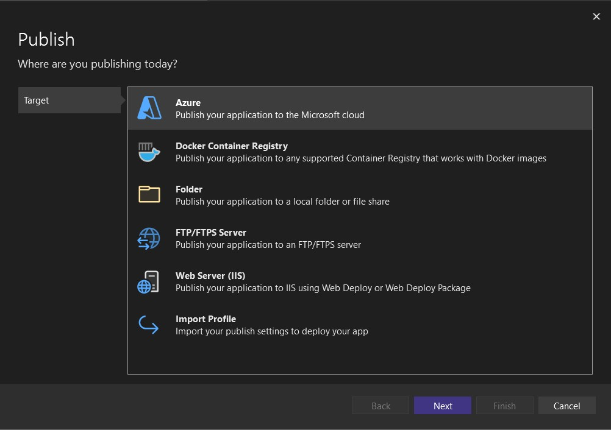

and Azure App service for Windows as the copute resource to host your bot

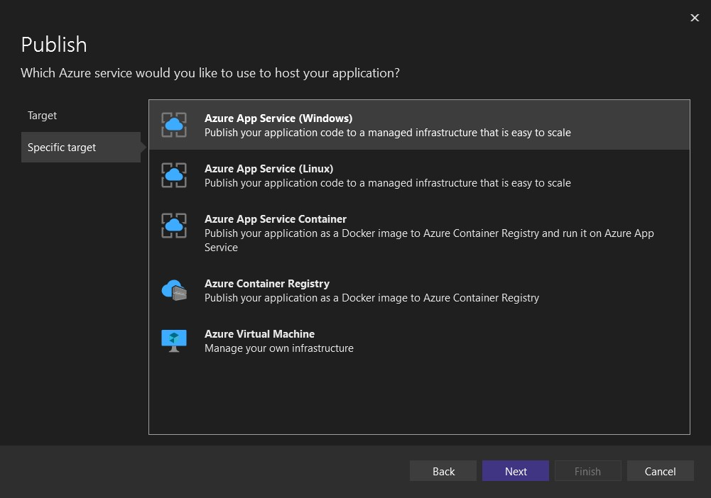

Complete the wizard by selecting the subscription and resource group to deploy the bot application as well as the app service instance to use. You can create a new one or select an existing app service instance if you already have one.

After the app service is deployed you can browse to the url of the app service and you should be able to get the bot default web page as shown here

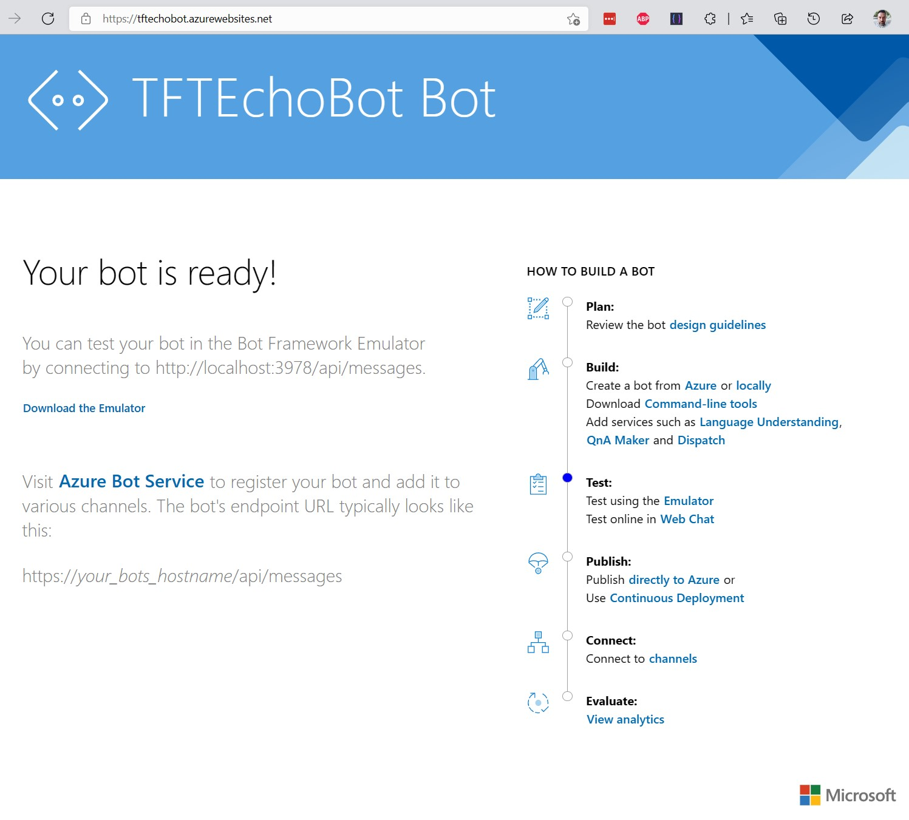

## Create Certificate for your bot ##
Before deploying your web application firewall you will need to create and have available a certificate for the front facing endpoint the firewall is going to expose.

> **NOTES** 
> - A self-signed certificate is not going to work as Bot Service and channels configured will not trust it when calling the WAF endpoint that exposes your Bot application.  
>
> - If you already have a certificate available for the dns name your bot is going to have, you can skip to the next step.

For this walkthrough you can use a **[LetsEncrypt](https://letsencrypt.org/)** certificate. There are multiple different ways you can acquire a LetsEncrypt certificate depending on your operating system and web server, using software that uses the [ACME protocol](https://tools.ietf.org/html/rfc8555).

Using **[win-acme (.NET)](https://www.win-acme.com/)** the process is really simple. The easiest way to validate you own the domain name is to use [DNS Validation](https://www.win-acme.com/reference/plugins/validation/dns/) as it does not require any changes your app service.

See how to create the certificate with win-acme at [win-acme guide](win-acme.md)

## Securing the Bot with Azure Application Gateway ##
Now that the bot is deployed we need to secure it by introducing a Web Application Firewall. To achieve that we are going to deploy an Azure Application Gateway and expose the Bot App Service through it.

### Basics tab

1. On the **Basics** tab, enter these values for the following application gateway settings:

   - **Resource group**: Select **myResourceGroupAG** for the resource group. If it doesn't exist, select **Create new** to create it.
   - **Application gateway name**: Enter *myAppGateway* for the name of the application gateway.
   - **HTTP2**: Enable HTTP2 support for the gateway

     

2. For Azure to communicate between the resources that you create, it needs a virtual network. You can either create a new virtual network or use an existing one. For this solution, you'll create a new virtual network at the same time that you create the application gateway. Application Gateway instances need separate subnets.

    > [!NOTE]
    > [Virtual network service endpoint policies](https://docs.microsoft.com/en-us/azure/virtual-network/virtual-network-service-endpoint-policies-overview) are currently not supported in an Application Gateway subnet.

    Under **Configure virtual network**, create a new virtual network by selecting **Create new**. In the **Create virtual network** window that opens, enter the following values to create the virtual network and two subnets:

    - **Name**: Enter *myVnet* for the name of the virtual network.

    - **Subnet name** (Application Gateway subnet): The **Subnets** grid will show a subnet named *Default*. Change the name of this subnet to *myAGSubnet*.<br>The application gateway subnet can contain only application gateways. No other resources are allowed.

    Select **OK** to close the **Create virtual network** window and save the virtual network settings.

     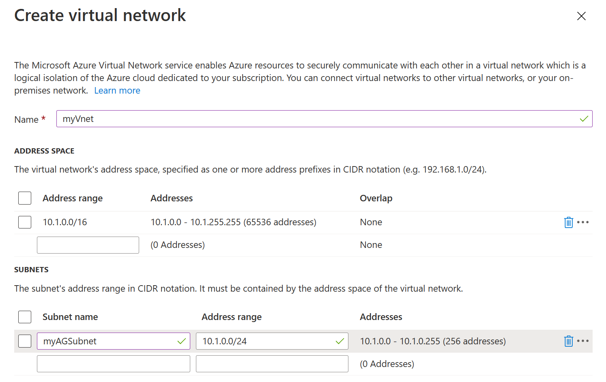
    
3. On the **Basics** tab, accept the default values for the other settings and then select **Next: Frontends**.

### Frontends tab

1. On the **Frontends** tab, verify **Frontend IP address type** is set to **Public**. <br>You can configure the Frontend IP to be Public or Private as per your use case. In this solution, you'll choose a Public Frontend IP.
   > [!NOTE]
   > For the Application Gateway v2 SKU, there must be a **Public** frontend IP configuration. You can still have both a Public and a Private frontend IP configuration, but Private only frontend IP configuration (Only ILB mode) is currently not enabled for the v2 SKU. 

2. Select **Add new** for the **Public IP address** and enter *myAGPublicIPAddress* for the public IP address name, and then select **OK**. 

     

3. Select **Next: Backends**.

### Backends tab

The backend pool is used to route requests to the backend servers that serve the request. Backend pools can be composed of NICs, virtual machine scale sets, public IP addresses, internal IP addresses, fully qualified domain names (FQDN), and multi-tenant back-ends like **Azure App Service** where the bot is hosted. So for this solution, you'll create an empty backend pool with your application gateway and then add backend targets to the backend pool.

1. On the **Backends** tab, select **Add a backend pool**.

2. In the **Add a backend pool** window that opens, enter the following values to create the backend pool:

    - **Name**: Enter *myBackendPool* for the name of the backend pool.
    - **Add backend pool without targets**: Select **no** to specify the backend pool target.
    - **Target type** select App Service
    - **Target** select the Bot App Service that was created previously

3. In the **Add a backend pool** window, select **Add** to save the backend pool configuration and return to the **Backends** tab.

     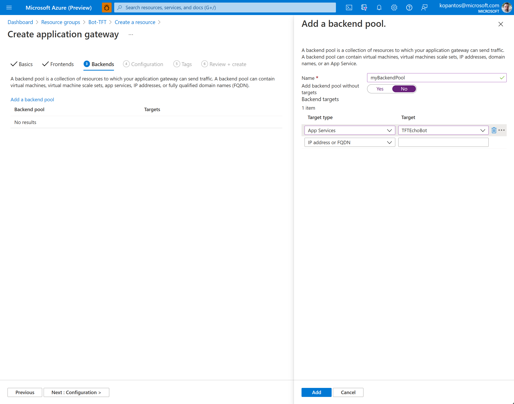

4. On the **Backends** tab, select **Next: Configuration**.

### Configuration tab

On the **Configuration** tab, you'll connect the frontend and backend pool you created using a routing rule.

1. Select **Add a routing rule** in the **Routing rules** column.

2. In the **Add a routing rule** window that opens, enter *myRoutingRule* for the **Rule name**.

3. A routing rule requires a listener. On the **Listener** tab within the **Add a routing rule** window, enter the following values for the listener:

    - **Listener name**: Enter *myListener* for the name of the listener.
    - **Frontend IP**: Select **Public** to choose the public IP you created for the frontend.
    - **Protocol**: Select HTTPS as Azure Bot Service endpoint configuration requiress a TLS connection.
    - **HTTPS Settings** Select upload certificate, browse and choose the certificated that was created and saved in the previous step and enter the password that was specified to secure the private key of the certificate. 
  
      Accept the default values for the other settings on the **Listener** tab, then select the **Backend targets** tab to configure the rest of the routing rule.

   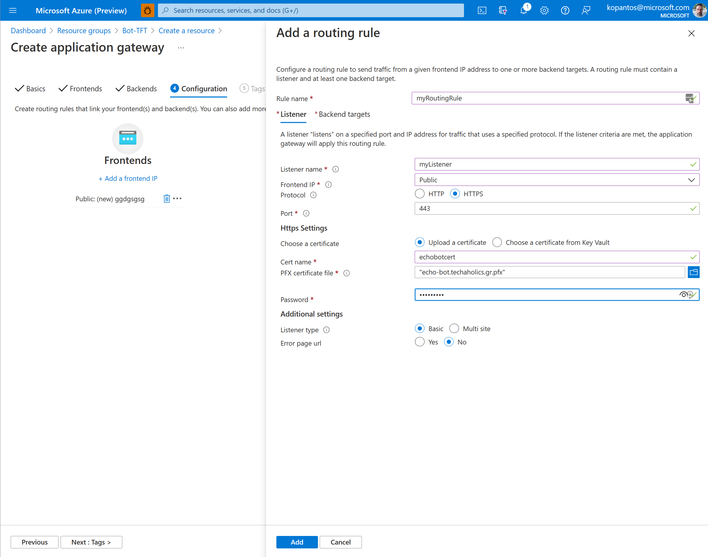

4. On the **Backend targets** tab, select **myBackendPool** for the **Backend target**.

5. For the **HTTP setting**, select **Add new** to add a new HTTP setting. The HTTP setting will determine the behavior of the routing rule. In the **Add an HTTP setting** window that opens, enter the following values:
- **HTTP setting name**: Enter *myHTTPSetting* for the name
- **Backend protocol**: select HTTPS to take advantage of the Azure App Service SSL enabled endpoint. 
- **Use well known CA certificate**: Select yes as the certificates used by default for Azure App Serive are signed by a well known Trusted Root Certificate Authority. 
- **Host Name** settings: Select to override the host name header coming in with the Target host name.

  Accept the default values for the other settings in the **Add an HTTP setting** window, then select **Add** to return to the **Add a routing rule** window. 

     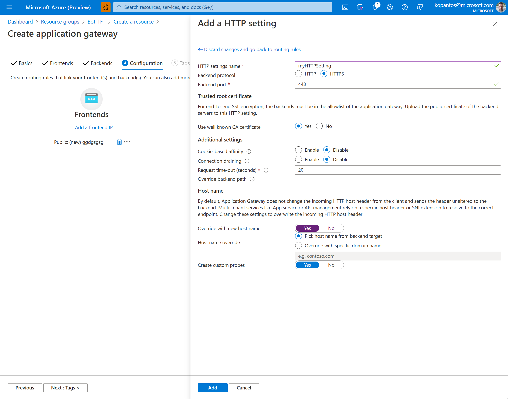

6. On the **Add a routing rule** window, select **Add** to save the routing rule and return to the **Configuration** tab.

     

7. Select **Next: Tags** and then **Next: Review + create**.

### Create a DNS record for the public IP of Application Gateway
Once the Azure Application Gateway has been provisioned you will need to create a new DNS entry at your Domain Zone management tool. 

For example, assuming that the IP that has been assigned to the Azure Application Gateway is 40.69.82.163 you will need to add a new A record with the domain name you want your bot to use.

``` 40.69.82.163 A echo-bot.contoso.com ```

### Validate Backend health
Before proceding to the creating of the Azure Bot Service you might want to chech the health of your Azure Application Gateway backend health. To do that navigate to your Azure Application Gateway resource and from the left menu blade select the **Backend Health** menu item.

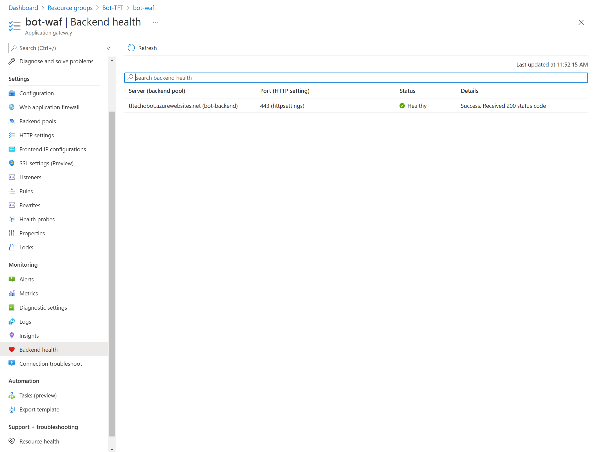

> **NOTE**
>
> You can enable the [Web Application Firewall](https://docs.microsoft.com/en-us/azure/web-application-firewall/ag/ag-overview) in **Detection** mode on your Application Gateway. 
>
> If you opt in for **Prevention** mode some of the channels may not work properly until you manually configure the firewall ruleset. 

### (Optional) Setup Azure Application Gateway access restrictions
By setting up access restrictions, you can define a priority-ordered allow/deny list that controls network access to your app. The list can include IP addresses or Azure Virtual Network subnets. When there are one or more entries, an implicit deny all exists at the end of the list.

[Setup access restrictions](https://docs.microsoft.com/en-us/azure/app-service/app-service-ip-restrictions#set-a-service-endpoint-based-rule)

## Create the Azure Bot Service ##
Next you will need to create the Azure Bot Service that will manage your Bot Registration to different channels.

Go to the Azure portal and in the right pane, select Create a resource. In the search box enter bot, then press Enter. Select the Azure Bot card and click create.

### Basics Tab ###

On the **Basics Tab** enter the following values 

- **Bot Handle** enter the name your bot will have
- **Subscription** select the subscription that Bot service will be provisioned to
- **Resource group** Select **myResourceGroupAG** to put the Bot service in the same Resource group as with the rest of the services.
- **Microsoft App ID** Select **Create new Microsoft App ID** for your Bot Service.

Accept the default values for the other settings in the **Basics Tab** and click **Next: Tags** and then **Review and Create**.


### Configure Bot Service ###
Once the Bot Service has been succesfully provisioned you will need to configure it to use the Bot deployed at the Azure App Service which is exposed through the Application Gateway.

1. Set the **Messaging Endpoint** 
  
   This will need to be the DNS name you gave to the Azure Application Gateway IP address followed by the path ``https://<your dns name>/api/messages``
   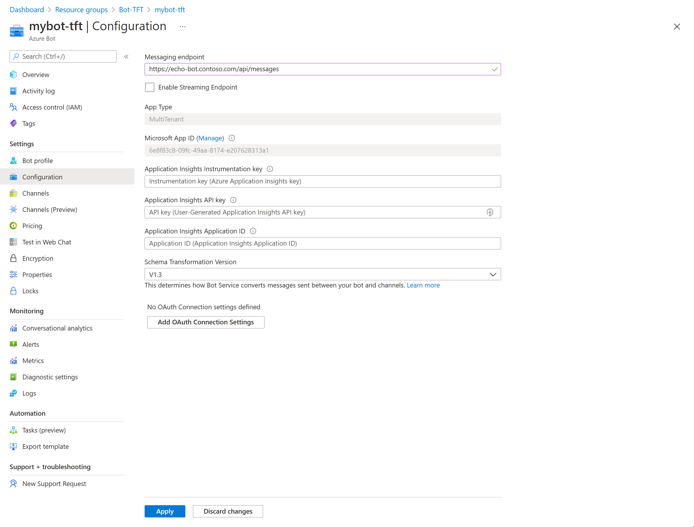

   Accept the default values for the other settings in this screen.

2. Get an **Application ID** and **Secret** to use with your Bot

   Your App Service deployed Bot Application needs this information to be passed as configuration values to allow access to it.

   Navigate to the application registered at your AD tenant by clicking the **manage** link next to the **Microsoft App ID** setting.

   At the **Certificates & Secrets** screen that will open click the **New client secret** at the bottom of the screen and add a descriptive name for the secret that will be created at the left hand side blade that will open. 

   Accept the default values for the expiration and click **Add**.

   > **!IMPORTANT**
   >
   > Copy the value of the secret that will be created as the value will be no longer available once you leave this screen.

   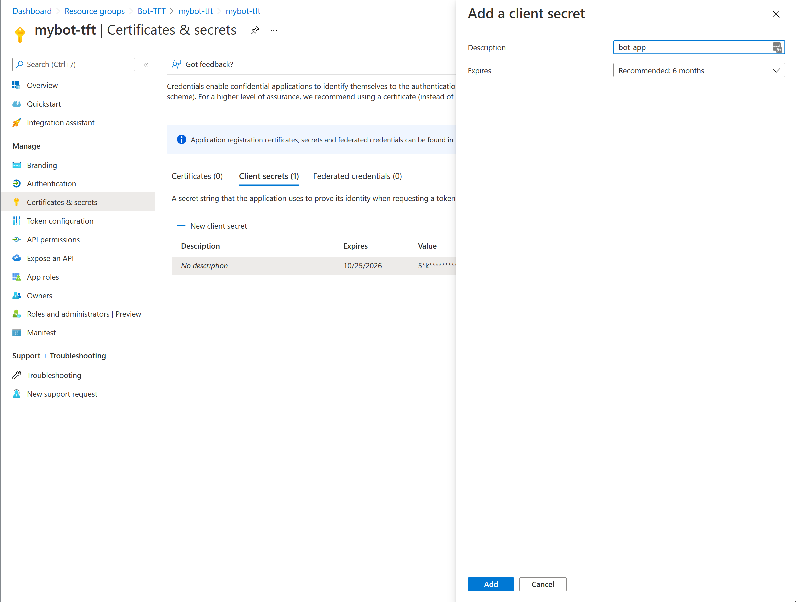

3. **Configure** your App Service with the App ID and Secret

    Next, you will have to provide the Application ID and Secret of the Bot Service Application registration to the Azure App Service hosting your Bot.

    To do that navigate to the **Configure** page of your Azure App Service and introduce two new **Application Settings** namely:

    - **MicrosoftAppId**: and enter the App ID value (You can find the value from the bot configuration page).
    - **MicrosoftAppPassword**: Enter the secret value that you noted down earlier.

    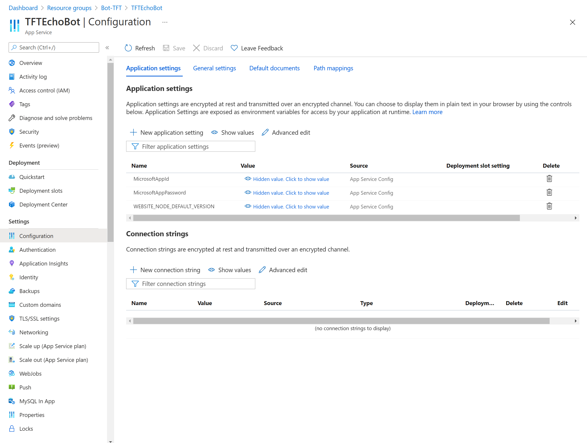

4. **Testing** the bot
    Now that everything is in place and configured, navigate back to your bot and from the left hand side blade select the **Test in Web Chat** menu item.

    You should be able to see a welcoming message from the bot. Type in a message and send it, the bot should echo what you've typed.

    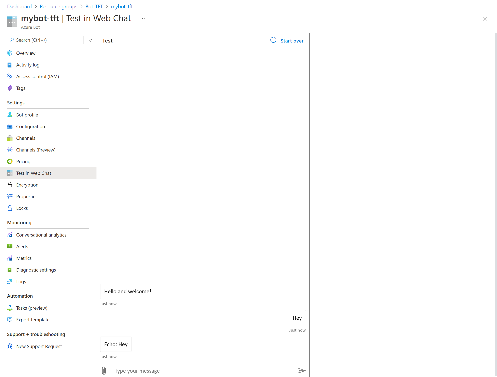